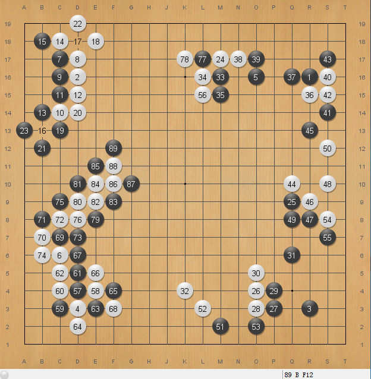

[中文版Readme](README-zh.md)

# FancyBing
A Go program implemented by pure JAVA with Deeplearning4j. The network architecture base on "[Mastering the Game of Go without Human Knowledge](https://deepmind.com/documents/119/agz_unformatted_nature.pdf)", but smaller netowrk, fewer features and without self playing. The network is trained with 1500,000 human games. Then also mixed 300,000 newest leelazero self play games.

# Performance
Tencent Fox 9d (18cores + 1 GTX1080, 15s), about half lost games are vs other AIs or because of misclick. It still not enough strong than Leela Zero, can compete with zen 9d, but less stable.

# What Improvements I did
## Improve the ladder reading ability by oversampling
Why most Go bots can't read ladder correctly is because there are few ladder failed samples in normal games. In high dan level games, player would avoid failure ladder in advance. So if the policynetwork is trained with human games, the network can't learn ladder well. Trained with self play games it would be better, but still need long time evolution.

I extract 500,000 continue atari moves (most of them are ladder related) from leela zero selfplay games, mixed them into normal train data which percentage is about 1-2%, after about 200,00 steps (batch: 128) extra training, the ladder reading improve obviously, it can solve most ladder problem after 5,000-20,000 playouts.

The following is one lost game of top AI BensonDarr, ladder is a difficult problem of AI, so even such top AI would fall into ladder trap. After above training, Fancybing can solve this ladder issue within few seconds. The following is the test results:
1) When black play move 75, FancyBing would play move 76 to escape the ladder, it is correct, because it is a success escape. 
2) When black play move 77, it is a ingenious ladder block move, but FancyBing would discover it within 10s and play E7 instead move 78.
3) Even if white already play 78 and black atari at move 79, FancyBing would avoid the escaping, and play E2 instead the fail escaping move 80.

## Improve the ko ability by oversampling
The method is same as above, but the ko moves are extracted from high level games.

## Improve opening
After normal training, I trained opening network with only 0-100 moves, the accuracy and MSE improved. When playing moves 0-80, use the opening netowrk, and then using the normal netowrk, the perofmrnace up to Fox 9d from weaker 8d.

I also trained mid game netowrk with 100+ moves, and end game network with 180+ moves, but seems not obviously improved. I didn't fully compare them.

# Requirements
* Recommend 8G+ Memory
* Nvidia GPU & Driver installed
* [CUDA 8.0](https://developer.nvidia.com/cuda-zone)
* [CUDNN 6.0](https://developer.nvidia.com/cudnn)
* [JDK1.8+](http://www.oracle.com/technetwork/java/javase/downloads/index.html)
* [GoGUI](https://sourceforge.net/projects/gogui/)

# Usage
At first, I don't recommend normal Go fans use any Go bots as a plug-in to play games in opening platforms such like KGS, Fox, Tygem. It is less interesting for other players to play too many games with computer. If the AI developer needs test it for researching, I suggest you mark AI in ID description. So that the human player can accept or reject to play against AI.

So, I didn't simply the requirements and usages steps here. But I think such are easy for true AI developers.

## Windows
* Finish the requiements section
* Download package and extract it
* Run startPolicyNetService.bat
* Run startFancybingService.bat
* Attach FancyBing player to GoGui, open GoGUI > Program > New Program Command: java -jar fancybing-gtp-1.0.jar Working Directory: the path of Fancybing 

# Training
## Download SGFs
[Computer go database](https://github.com/yenw/computer-go-dataset)
Please transfer other format into sepearte SGF files.

## Generate the training data
See [FeatureGenerator.java](/fancybing-train/src/main/java/net/xdevelop/go/preprocess/FeatureGenerator.java)

The generator would random pick moves from the sgfs and generate feature files named 0.txt, 1.txt, 2.txt... each contains 51200 records.

Please use the all() function to generate normal training data. The open(), mid(), end() functions are used to generate data for opening, mid, end game.

Unlike AlphaGo Zero's 18 features, Fancybing uses 10 features only:
1) Black Stones
2) White Stones
3) Empty Points
4) 1 liberties stone group
5) 2 liberties stone group
6) 3 liberties stone group
7) &gt;3 liberties stone group
8) Ko
9) last 8 history moves
10) next move color

## Training
See [ResNetwork.java](/fancybing-policynet/src/main/java/net/xdevelop/go/policynet/PolicyNetService.java)

The early stop implementation is not good enough in DL4j 0.9.1, so I train the model by sepearate data file, so that you can stop the training at any time, and adjust the learing rate then continue the training by manual increase the start file index.

# License
The code is released under the GPLv3 or later, any commercial usage please contact me (john.h.cn@gmail.com).
